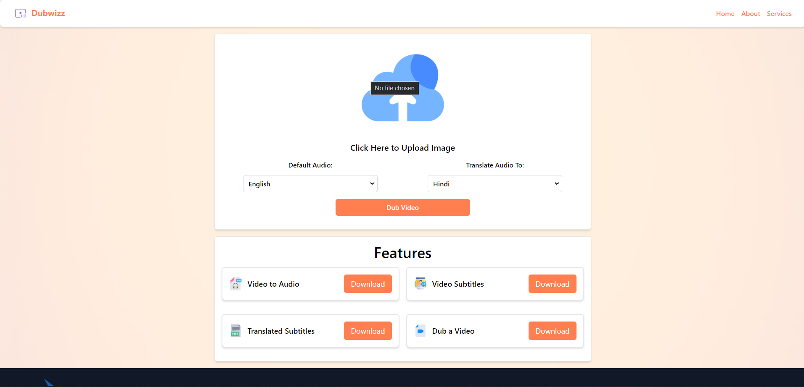
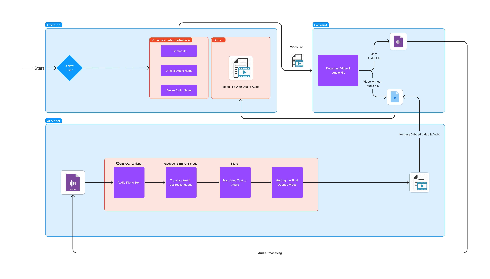

<div align="center">
  <h1> Dubwiz : A Multilingual Video Dubbing System </h1>
  

</div>
<br>

This project aims to create a video dubbing application that can translate spoken English in videos to various regional Indian languages. The backend of this project utilizes Python technologies such as PyTorch, Flask, and various machine learning libraries for speech recognition, translation, and audio processing. The frontend is built using ReactJS to provide an interactive user interface.

## Overall Workflow of Project
<div align="center">

</div>

### Project Structure

```
project-root/
│
├── backend/
│   ├── server.py                 # Flask server script
│   ├── requirements/
│   │   └── requirements.txt      # Backend Python dependencies
│   ├── final/                    # Directory to store final dubbed video
│   ├── output/                   # Directory to store output files (subtitles, audio)
│   └── ...
│
└── frontend/
    ├── public/
        └── index.html
    ├── src/
    │   └── ...                    # ReactJS frontend source files
    ├── package.json               # Frontend Node.js dependencies
    └── ...
```

### Frontend (ReactJS)

- The frontend of this project is developed using ReactJS. You'll need Node.js and npm (Node Package Manager) to install and manage the frontend dependencies. Ensure you have Node.js installed, then navigate to the \`frontend\` directory and run:

```bash
npm install
```

This will install all the required frontend dependencies listed in \`frontend/package.json\`.

- To run the frontend, use the following commands:

```bash
cd client
```
```bash
npm start
```

### Backend Requirements

To run the backend of this project, you'll need the following Python libraries:

- torch
- torchaudio
- transformers
- datasets
- moviepy
- requests
- Flask
- gunicorn
- python-dotenv
- soundfile
- librosa

These requirements are specified in the \`requirements.txt\` file provided in the \`backend\` folder. You can install these dependencies using pip:

```bash
pip install -r backend/requirements.txt
```

To run the backend server, use the following commands:

```bash
cd server
```
```bash
python server.py
```


## Usage

1. **Setting up the Backend**:
   - Install Python dependencies using \`pip\` as described above.
   - Start the Flask server by running \`python backend/server.py\` from the project root directory.

2. **Setting up the Frontend**:
   - Install frontend dependencies using \`npm install\` from the \`frontend\` directory.
   - Start the React development server to run the frontend interface.

3. **Workflow**:

   - **Frontend**:
     - User uploads a video file through the frontend interface.

   - **Backend**:
     - The backend receives the uploaded video file.
     - The video file is processed to detach the audio using ***<b>MoviePy library.</b>***
     - The extracted audio is saved in the \`backend/output\` directory.

     - The extracted audio is transcribed into English text using ***<b>OpenAI's Whisper model.</b>***
     - The English text is translated into the desired regional language using ***<b>Facebook's mBART model (\`facebook/mbart-large-50-one-to-many-mmt\`).</b>***
     - The translated text is converted back into audio using a speech synthesis model like ***<b>Silero.</b>***

     - The original video file is combined with the newly generated audio to create the final dubbed video.
     - The final dubbed video is saved in the ***\`backend/final\`*** directory.

## Sample Input Video

You can use the following sample input video for testing the video dubbing application:


## Sample Output Video

Here is an example of the output video generated by the video dubbing application:


## Contributors

- [OM GUJARATHI](https://github.com/Om-Gujarathi)
- [SANSKAR GUNDECHA](https://github.com/SANSKARG83)
- [ASAWARI JADHAV](https://github.com/AsawariJadhav)
